## 🔧 Features

- ✅ Google OAuth 2.0 login
- ✅ Spring Security integration
- ✅ Access public and private endpoints
- ✅ Retrieve authenticated user profile data
- ✅ REST APIs for user data with mysql
- ✅ Deployed a spring boot application on Kubernetes

# 🚀 Technologies Used

- ✅ Java 17+
- ✅ Spring Boot 3.x
- ✅ Spring Security
- ✅ OAuth 2.0 Client (Google)
- ✅ Maven
- ✅ Docker
- ✅ Argo Cd
- ✅ Aws EKS | ECR | ECS

# Testing Rest APIs:
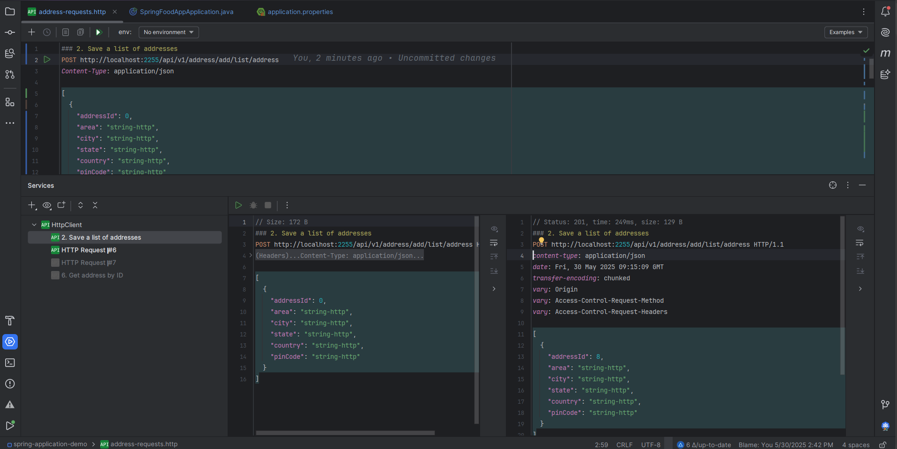
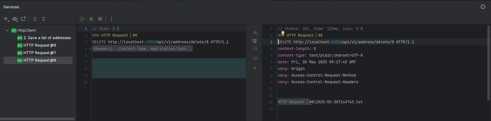
# Create a DataBase For Spring Boor Application:
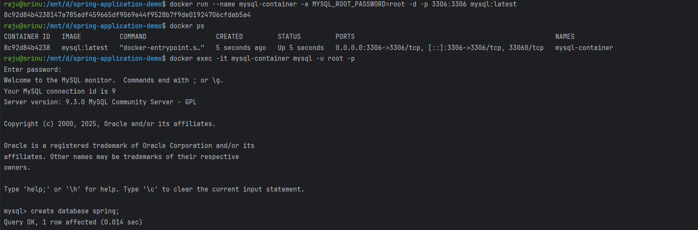
# Create A Jar File:
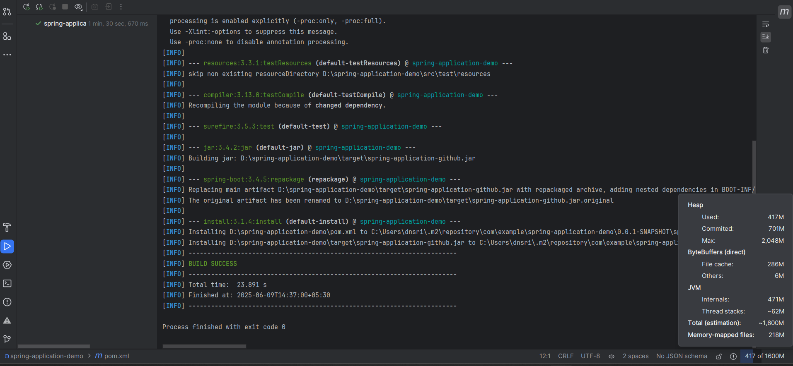
# Pushed Docker Image to Registry :
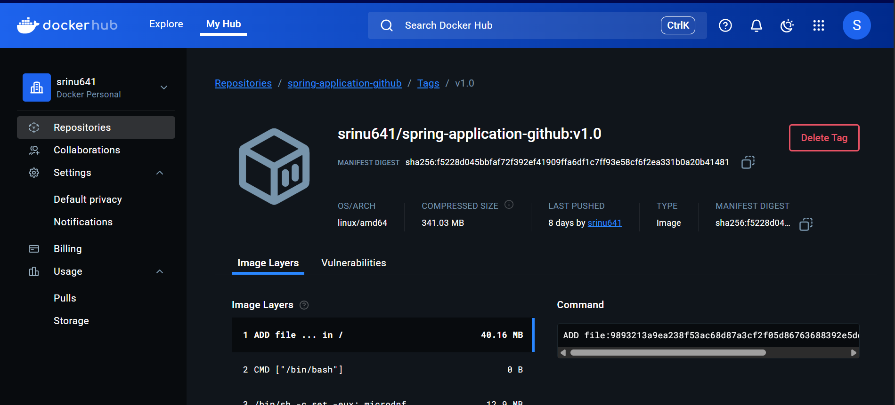
# Github Actions CI CD Pipeline: 
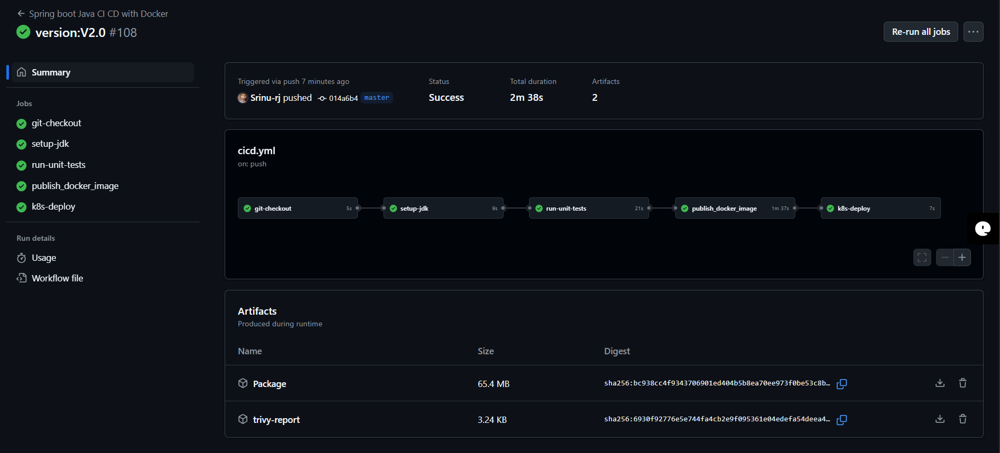
# Aws ECS Architecture to Deploy Spring Boot Application: 
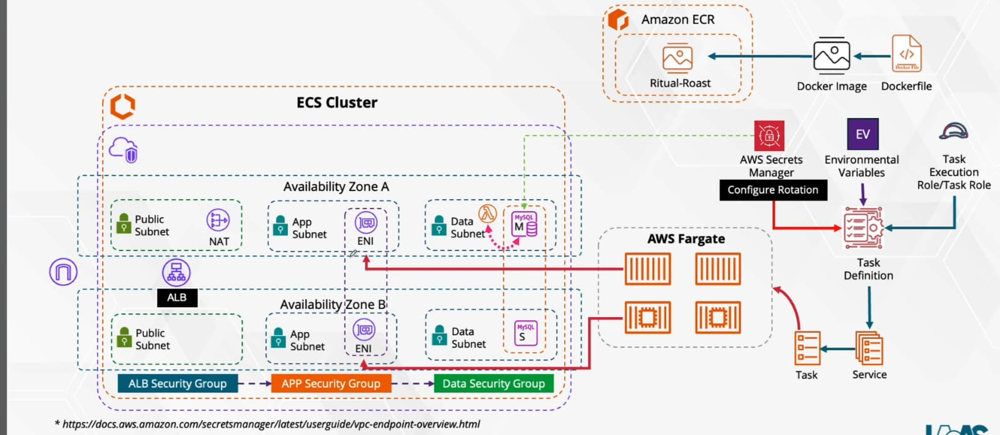
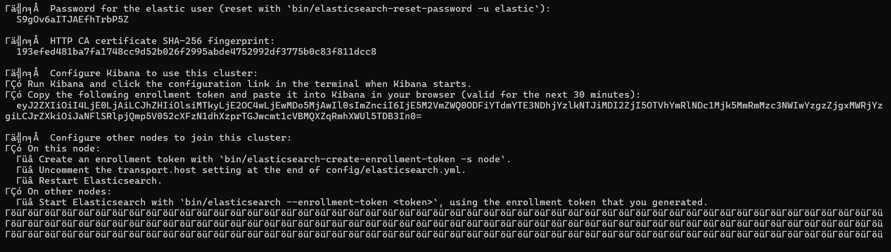
# ElasticSearch Status:
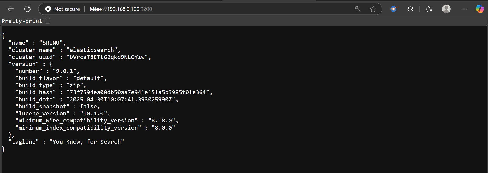
# Started Kibana Server:
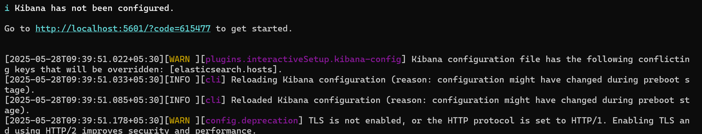
# To start kibana server
http://localhost:5601/?code=615477
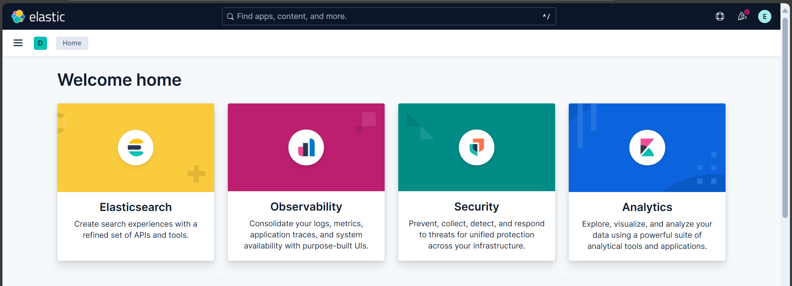
# Implemented Redis Cache to spring Rest APIS: 
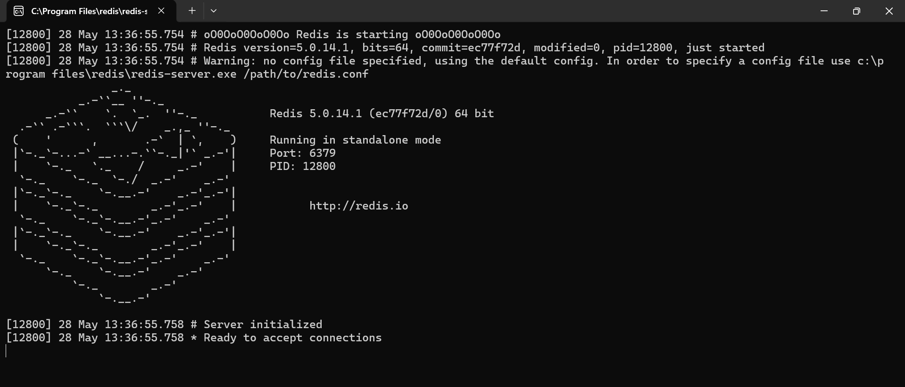
# Kubernetes Architecture 
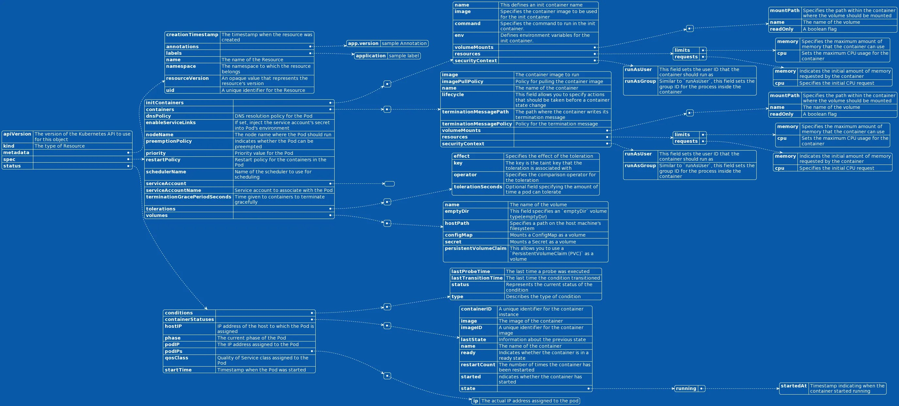
# Monitoring Observabilities of Spring Boot Application 
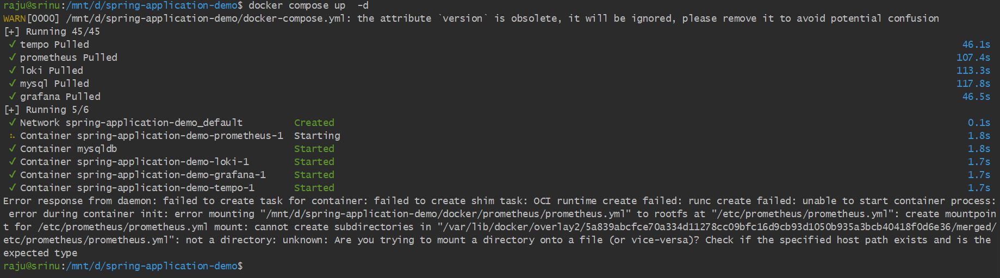

# Deploy Spring boot application with postgres SQL
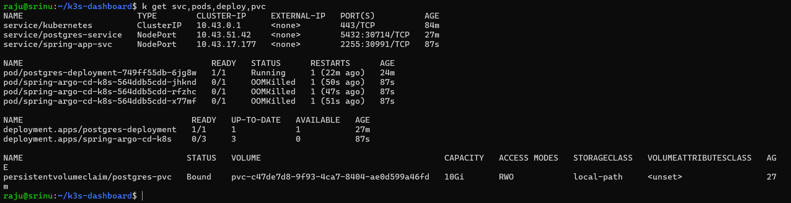
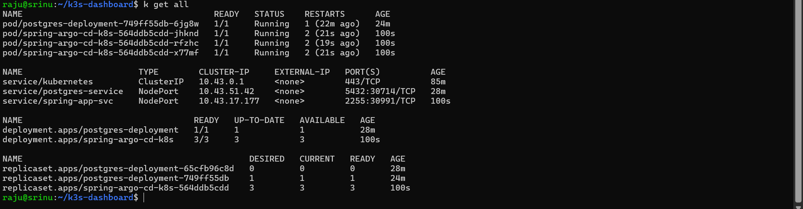
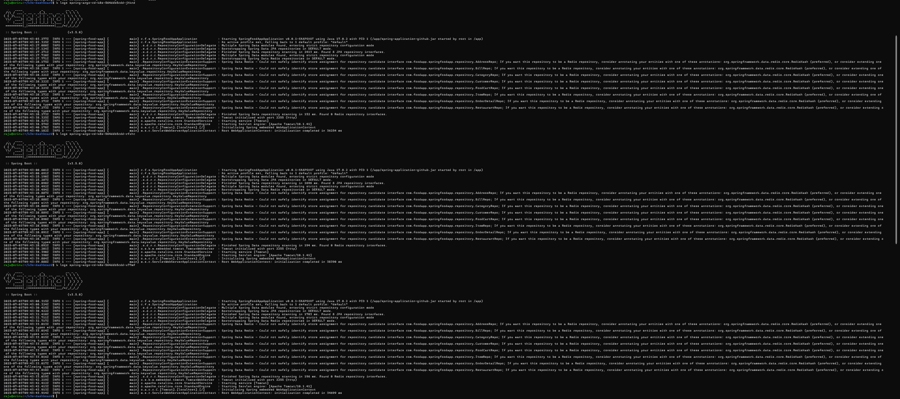